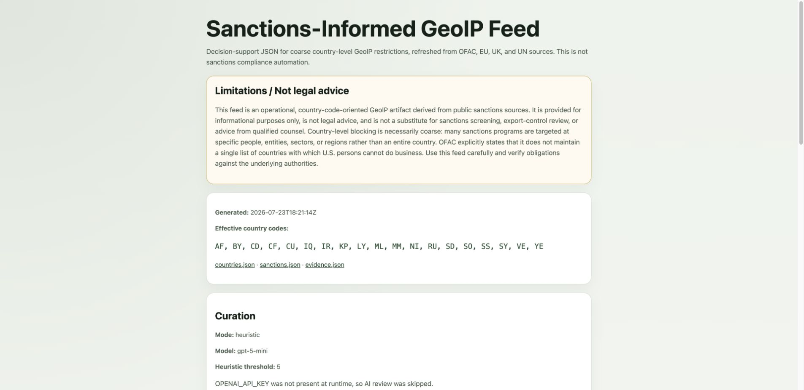
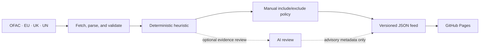

# Sanctions-Informed GeoIP Restriction Feed

[](https://github.com/jtgorny/ofac-georestriction/actions/workflows/ci.yml)
[](https://github.com/jtgorny/ofac-georestriction/actions/workflows/update-sanctions.yml)
[](LICENSE)

> **Decision-support data only — not sanctions compliance automation or legal advice.**

A transparent, source-backed JSON feed for coarse country-level GeoIP restrictions. It combines
country-specific signals from the United States Office of Foreign Assets Control (OFAC), European
Union, United Kingdom, and United Nations; applies an inspectable heuristic; and publishes the
result through GitHub Pages.

[View the live feed](https://jtgorny.github.io/ofac-georestriction/) ·
[Read the smallest JSON payload](https://jtgorny.github.io/ofac-georestriction/countries.json)

## Why this exists

Country-level access restrictions are sometimes used as one layer of a broader risk-control
program, but the underlying public sanctions sources are structured around different authorities,
regimes, people, entities, sectors, and regions. Turning those sources into an operational GeoIP
input usually requires undocumented judgment and manual reconciliation.

This project makes that judgment inspectable. It publishes normalized source evidence, a
deterministic scoring model, explicit manual overrides, and an optional advisory AI review so a
security or platform engineer can audit why a country code appears—or does not appear—in the
effective list.

## Limitations / Not legal advice

- Country-level GeoIP blocking is coarse. It can over-block legitimate users, miss sanctioned
  actors using proxies or virtual private networks (VPNs), and cannot perform entity screening.
- Many sanctions are targeted at people, organizations, sectors, vessels, or regions rather than
  every person or transaction associated with a country.
- Source pages, regime names, legal obligations, and country mappings can change between refreshes.
- The optional AI review is advisory metadata. It does not control the effective block list.
- Downstream operators must validate the feed against their legal obligations, contracts, risk
  model, exception process, and rollback plan.
- This independent open-source project is not endorsed by or affiliated with OFAC or any other
  source authority.

## Preview

The generated GitHub Pages site keeps the current effective list, source evidence, curation mode,
and legal limitations visible together:



## Project status

The feed is automatically rebuilt at 05:00 UTC each day. The deterministic heuristic controls the
published block list; optional AI curation is advisory and cannot add a country that is absent from
the collected source evidence. Generated payloads carry a `schema_version` so consumers can detect
future contract changes.

## Architecture

The following diagram shows the build and publication path:



In plain text: public sources become normalized evidence, the deterministic heuristic establishes
the baseline, optional AI analysis adds advisory metadata, manual overrides produce the effective
list, and GitHub Pages serves the versioned JSON and static summary. When AI review is disabled or
fails, the heuristic and overrides still produce the effective list.

The output separates four concepts:

1. `sanctioned_country_codes` is the country-level union inferred from recognized sanctions
   regimes.
2. `heuristic_recommended_country_codes` is the deterministic score-based recommendation.
3. `ai_recommended_country_codes` is the optional model's advisory recommendation.
4. `effective_geoip_block_country_codes` is the heuristic recommendation after manual overrides.

## Quick start

Prerequisites:

- Python 3.12 or later
- Network access to the source URLs listed below
- An OpenAI API key only if you want the optional AI review

From the repository root, run the tests and build the site:

```bash
python3 -m unittest discover -s tests
python3 scripts/build_site.py
```

A successful build prints the curation mode and the four files written to `docs/`. To inspect the
site locally, start a static server:

```bash
python3 -m http.server 8000 --directory docs
```

Then open `http://localhost:8000`. Stop the server with `Ctrl+C`.

## Published outputs

All public artifacts are generated under [`docs/`](docs/):

| File | Purpose |
| --- | --- |
| [`countries.json`](docs/countries.json) | Compact consumer payload with the effective and supporting country-code lists |
| [`sanctions.json`](docs/sanctions.json) | Full source metadata, normalized country evidence, heuristic configuration, and disclaimer |
| [`evidence.json`](docs/evidence.json) | Scorecards, override details, and optional AI review output |
| [`index.html`](docs/index.html) | Accessible human-readable summary deployed to GitHub Pages |

Consumers should read `schema_version` before processing a payload and treat an unknown major
version as incompatible. Country codes use ISO 3166-1 alpha-2 where a recognized code exists.
Non-country and non-ISO territorial regimes are not emitted.

### Example `countries.json`

The following is valid illustrative output. Country arrays are shortened to keep the example
readable; the live endpoint contains the complete arrays and current generation timestamp.

```json
{
  "schema_version": "1.0",
  "generated_at": "2026-07-23T14:42:41Z",
  "heuristic_recommended_country_codes": [
    "CU",
    "IR",
    "KP",
    "SY"
  ],
  "ai_recommended_country_codes": [],
  "effective_geoip_block_country_codes": [
    "CU",
    "IR",
    "KP",
    "SY"
  ],
  "sanctioned_country_codes": [
    "CU",
    "IR",
    "KP",
    "SY"
  ],
  "heuristic_threshold": 5,
  "disclaimer": "This feed is an operational, country-code-oriented GeoIP artifact derived from public sanctions sources. It is provided for informational purposes only, is not legal advice, and is not a substitute for sanctions screening, export-control review, or advice from qualified counsel. Country-level blocking is necessarily coarse: many sanctions programs are targeted at specific people, entities, sectors, or regions rather than an entire country. OFAC explicitly states that it does not maintain a single list of countries with which U.S. persons cannot do business. Use this feed carefully and verify obligations against the underlying authorities."
}
```

## Configuration

Manual policy lives in [`config/overrides.json`](config/overrides.json):

```json
{
  "manual_include_country_codes": ["RU"],
  "manual_exclude_country_codes": ["VE"],
  "notes_by_country_code": {
    "RU": "Approved operational restriction",
    "VE": "Country-wide restriction explicitly excluded"
  }
}
```

Codes must be two-letter strings, an include and exclude cannot overlap, and every configured code
must still be supported by current source evidence. Invalid configuration fails the build before
public artifacts are written.

The optional OpenAI integration uses these environment variables:

| Variable | Required | Default | Purpose |
| --- | --- | --- | --- |
| `OPENAI_API_KEY` | No | AI review disabled | Authenticates the server-side Responses API request |
| `OPENAI_MODEL` | No | `gpt-5-mini` | Selects the model used for advisory curation |

The model default is defined once as `DEFAULT_OPENAI_MODEL` in
[`scripts/build_site.py`](scripts/build_site.py). GitHub Actions can override it with the
`OPENAI_MODEL` repository variable. The current default supports the Responses API and structured
outputs; see the [official model reference](https://developers.openai.com/api/docs/models/gpt-5-mini).

To use AI curation locally, provide `OPENAI_API_KEY` through your shell environment or a trusted
secret manager, optionally set `OPENAI_MODEL`, and run the normal build command. Do not put the key
in a command, source file, scratchpad, `.env` file committed to Git, or browser code.

In GitHub Actions, store the key only as the `OPENAI_API_KEY` repository secret. The workflow passes
it to the build process without writing it to generated artifacts. If the AI request fails, the
effective list remains heuristic-driven and the public error is sanitized.

## Heuristic

The default threshold is `5`. A country receives points from these inspectable signals:

| Signal | Points |
| --- | ---: |
| OFAC broad-country baseline | 3 |
| OFAC country or program signal | 2 |
| Present in at least two authorities | 1 |
| Present in at least three authorities | 2 |
| Present in a UN committee program | 1 |

The threshold favors broad or strongly corroborated country evidence. It intentionally avoids
turning every targeted sanctions program into a country-wide block.

## Data sources

The build uses these public primary sources:

- [OFAC sanctions programs and country information](https://ofac.treasury.gov/sanctions-programs-and-country-information)
- [EU sanctions tracker regimes](https://data.europa.eu/apps/eusanctionstracker/regimes/)
- [UK sanctions list publication](https://www.gov.uk/government/publications/the-uk-sanctions-list)
- [UK sanctions list XML](https://sanctionslist.fcdo.gov.uk/docs/UK-Sanctions-List.xml)
- [UN consolidated list page](https://main.un.org/securitycouncil/en/content/un-sc-consolidated-list)
- [UN consolidated list XML](https://scsanctions.un.org/resources/xml/en/consolidated.xml)

[OFAC Sanctions List Search](https://sanctionssearch.ofac.treas.gov/) is published as a supporting,
entity-oriented reference. It is not scraped as a country-code feed.

Upstream page structure and regime names can change. The build retries transient HTTP failures and
fails if any authority produces no recognized country regimes, preventing an empty parser result
from silently weakening the feed.

## Automation and releases

- [`ci.yml`](.github/workflows/ci.yml) compiles the Python code, runs unit tests, validates checked-in
  JSON, and rejects OpenAI-style secrets in tracked files.
- [`update-sanctions.yml`](.github/workflows/update-sanctions.yml) refreshes the feed daily and
  commits changes with a UTC timestamp such as
  `data: refresh sanctions feed (2026-07-23T05:00:00Z)`.
- [`deploy-pages.yml`](.github/workflows/deploy-pages.yml) deploys `docs/` to GitHub Pages.
- [`release-please.yml`](.github/workflows/release-please.yml) manages tagged releases and the
  [`CHANGELOG.md`](CHANGELOG.md).
- [Dependabot configuration](.github/dependabot.yml) monitors pinned GitHub Actions.

All third-party Actions are pinned to full commit SHAs. Scheduled data-only commits are excluded
from release generation.

## Security and responsible use

Review [`SECURITY.md`](SECURITY.md) before reporting a vulnerability or handling an exposed key.
GitHub secret scanning and push protection are enabled for this public repository. No credential
belongs in the generated site: everything under `docs/` is public.

GeoIP is a coarse control and can be bypassed or produce false positives. Before adopting this feed,
validate it against your legal obligations, customer commitments, risk model, proxy and VPN
handling, and an emergency rollback path.

## Contributing

See [`CONTRIBUTING.md`](CONTRIBUTING.md) for the development workflow, validation commands, and pull
request conventions.

## License

Source code, documentation, and generated artifacts are available under the
[Apache License 2.0](LICENSE).
